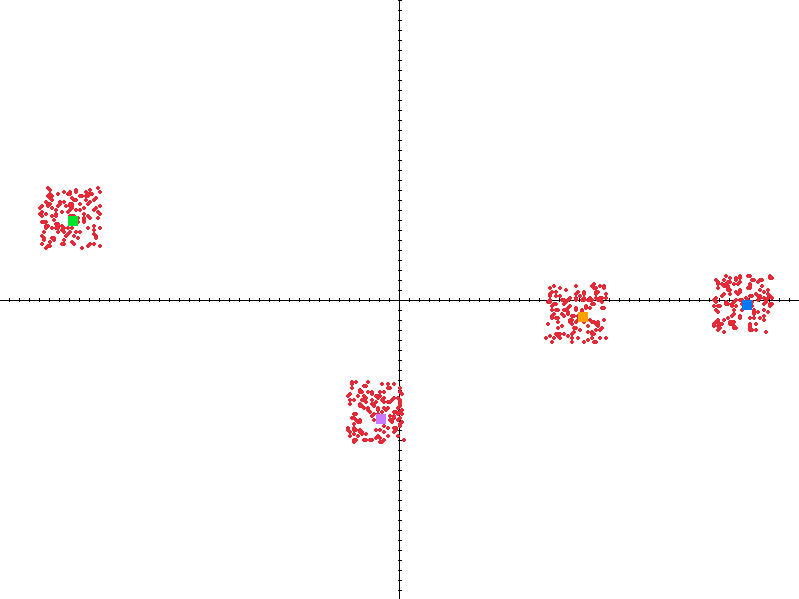

# k-means clustering

Simple implementation of the k-means clustering algorithm.
Demo generates samples of data points at random.
The visualisation uses [raylib](https://github.com/raysan5/raylib).

## Example

  

